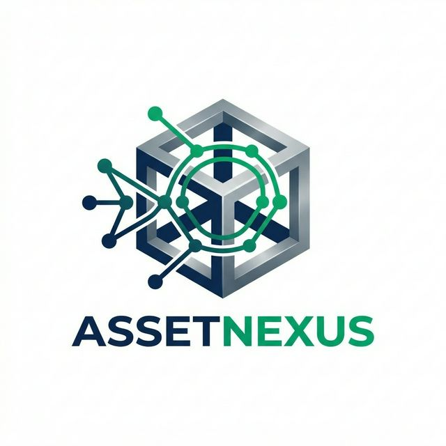

# 🚀 AssetNexus - Enterprise Asset Management System

<div align="center">
  
  <p align="center">
    <strong>Empowering Organizations with Seamless, Secure, and Scalable Asset Management.</strong>
  </p>

  [](https://spring.io/projects/spring-boot)
  [](https://www.oracle.com/java/)
  [](https://www.mysql.com/)
  [](LICENSE)
</div>

---

## 🌟 Overview

**AssetNexus** is a state-of-the-art Enterprise Asset Management application designed to streamline the lifecycle of physical assets within an organization. From procurement to disposal, AssetNexus provides administrators with a centralized dashboard to track, maintain, and allocate resources efficiently.

Whether you are managing a college, a corporate office, or a large-scale manufacturing unit, AssetNexus ensures that every asset is accounted for, maintained on time, and assigned to the right personnel.

---

## 🚀 Key Features

### 📦 Asset Lifecycle Management
- **Smart Tracking**: Register assets with detailed specifications, serial numbers, and purchase dates.
- **Category Hierarchy**: Organize equipment into logical categories (e.g., IT Hardware, Furniture, Lab Equipment).
- **Status Monitoring**: Real-time tracking of asset status (Available, Assigned, Under Maintenance, Disposed).

### 👥 Personnel & Assignment
- **Employee Directory**: Manage detailed profiles of all organization members.
- **One-Click Assignment**: Seamlessly assign and de-assign assets to employees with automated history logging.
- **Bulk Upload**: Import hundreds of employee or asset records instantly using **Excel file processing**.

### 🛠️ Maintenance & Health
- **Maintenance Ticketing**: Raise service requests for faulty assets.
- **Service History**: Keep a digital log of all repairs, costs, and technician notes.
- **Automated Alerts**: Receive email notifications for pending maintenance or warranty expirations.

### 📊 Intelligence & Reporting
- **Dynamic Dashboard**: Visual representations of asset distribution and maintenance health.
- **PDF Generation**: Generate professional maintenance reports and asset catalogs in one click.
- **QR Code Integration**: Every asset gets a unique QR code for instant identification via mobile scanning.

### 🔐 Enterprise Security
- **Role-Based Access**: Specialized views for Super Admins, Managers, and Staff.
- **Secure Authentication**: Robust login system powered by **Spring Security**.

---

## 🛠️ Technology Stack

| Layer | Technology |
|---|---|
| **Backend** | Java 17, Spring Boot 3.4.2 |
| **Security** | Spring Security |
| **Persistence** | Spring Data JPA, MySQL |
| **Frontend** | Thymeleaf, Vanilla CSS (Premium UI) |
| **Processing** | Apache POI (Excel), ZXing (QR), OpenPDF (PDF) |
| **Communication** | Spring Mail (Gmail SMTP) |

---

## 🏃 Getting Started

### Prerequisites
- Java 17 or higher
- MySQL Server
- Maven 3.6+

### 1. Database Configuration
Create a database named `assetsdb` in MySQL and update the `backend/src/main/resources/application.properties` file:

```properties
spring.datasource.url=jdbc:mysql://localhost:3306/assetsdb
spring.datasource.username=YOUR_USERNAME
spring.datasource.password=YOUR_PASSWORD
```

### 2. Build the Project
Open your terminal in the root directory and run:

```bash
cd backend
./mvnw clean install
```

### 3. Run the Application
```bash
./mvnw spring-boot:run
```
The application will be accessible at: **`http://localhost:8085`**

---

## 📸 Screenshots

| Dashboard | Asset Inventory | Employee Portal |
|---|---|---|
|  |  |  |

---

## 🤝 Contributing
Contributions are what make the open-source community such an amazing place to learn, inspire, and create. 

1. Fork the Project
2. Create your Feature Branch (`git checkout -b feature/AmazingFeature`)
3. Commit your Changes (`git commit -m 'Add some AmazingFeature'`)
4. Push to the Branch (`git push origin feature/AmazingFeature`)
5. Open a Pull Request

---

<div align="center">
  Crafted with precision by <a href="https://github.com/Deepansh1822">Deepansh</a>
</div>
